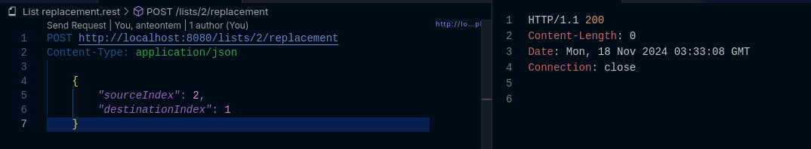

# Lista de Jogos

Este projeto trata-se de uma aplicação back-end voltada para o gerenciamento de jogos. Ele permite organizar e categorizar os jogos de forma eficiente, além de possibilitar a personalização do seu posicionamento, oferecendo uma estrutura flexível para que os usuários possam gerenciar seus jogos de acordo com suas necessidades e preferências.

## Modelo de domínio Game_List

Nesta seção, é apresentado o Diagrama de Classe (UML), que ilustra a estrutura e as relações dos dados armazenados em memória.

## Estrutura de Dados

Nesta seção, é apresentada toda a Estrutura de Dados, organizada em tabela pelo banco de dados, que ilustra as posições dos jogos em cada lista **(1 e 2)**, juntamente com seus respectivos IDs e os IDs das Listas:

A primeira lista representa os jogos de RPG e Ação.
A segunda lista representa os jogos de Plataforma, como, por exemplo, os jogos de SNES, Playstation, entre outros.

## Reposicionar os Jogos 

Nesta seção, é possível reposicionar os jogos, fornecendo como parâmetros os IDs dos jogos e das listas a que pertencem, permitindo a reorganização conforme a necessidade. Abaixo segue a ilustração do processo.

### 1. Parâmetros da Requisição

### 2. Resposta em JSON

## Tecnologias Utilizadas:

- JAVA **(Linguagem)**

- SPRING **(FrameWork)**

- DOCKER **(Ambiente)**

- H2 **(Banco de Dados 'Teste')**

- POSTGRES **(Banco de Dados 'Homologação')**

- GIT, GITHUB **(Versionamento de Código)**

## Autor

- [@danielprogram08](https://github.com/danielprogram08)

## Referência

- [Intensivão Java + Spring - Prof. Nelio Alves](https://devsuperior.com.br/)
